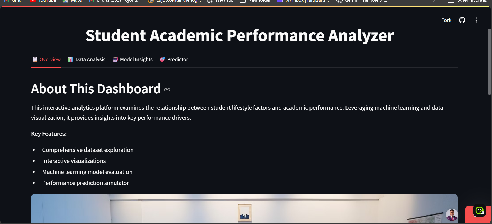
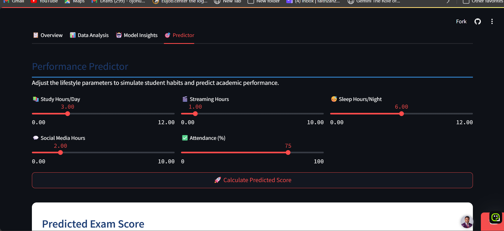

# 🎓 Student Academic Performance Dashboard

An interactive analytics and prediction platform exploring how lifestyle habits, mental health, and academic behaviors impact student performance — built using data science and machine learning.

---

## 📌 Key Features

- 📊 Multi-tab interactive dashboard with rich visualizations
- 🧠 Machine learning model to estimate student exam scores
- 📈 Exploratory Data Analysis (EDA) with dynamic filters
- 🧪 Feature Engineering: correlation heatmap and distribution visualizer
- 🎯 Predictive Simulator: input study, sleep, media habits to forecast performance
- 🔄 Actual vs Predicted exam score comparisons
- 🎛️ Sidebar filters by age, attendance, and mental health rating

---

## 🧰 Tech Stack

- **Frontend**: Streamlit
- **Backend**: Python
- **Libraries**:
  - `pandas`, `numpy`, `joblib`
  - `scikit-learn`, `matplotlib`, `seaborn`, `plotly`, `statsmodels`

---

## 🚀 Live App

Try the live app here:  
👉 [https://student-insight-app.streamlit.app](https://student-insight-app.streamlit.app)

---

## 🖼️ Screenshots

### 📋 Dashboard Overview  

### 🎯 Predictive Score Output  

---

## 🗂️ Repository Contents

- `app.py`: Main Streamlit app
- `requirements.txt`: Project dependencies
- `student_habits_performance.csv`: Dataset
- `scaler.pkl`, `best_model.pkl`: Trained scaler and regression model
- `assets/`: Folder with image resources for README

---

## 🤝 Contributions & Feedback

Feel free to fork the project, raise issues, or contribute enhancements.  
📬 Connect with me on [LinkedIn](https://www.linkedin.com/in/ojonugwa-wada-47ba55b7)

---

© 2025 Ojonugwa Wada | Academic & Educational Research
